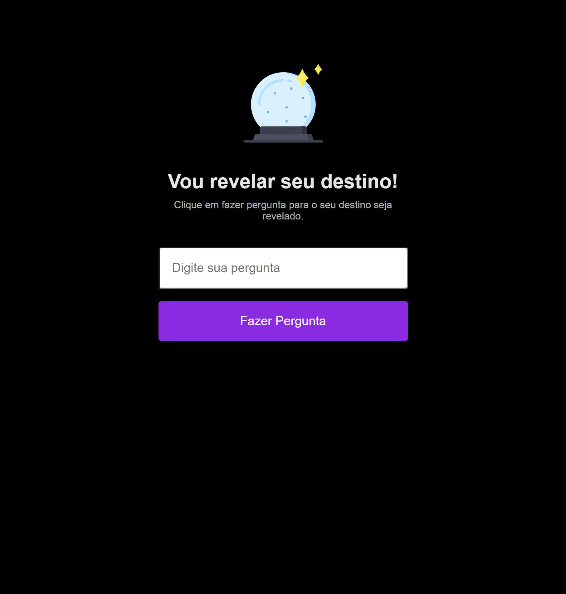

 
 

> ## Sobre o Projeto

Esse projeto foi desenvolvido na Maratona Explorer da @Rocketseat. Uma semana do dia 6 a 12 de junho de 2022, desenvolveu-se uma aplicação completa do zero.

Projeto: Descubra o seu destino!

* Aula 01 - HTML

Aprendemos o que é HTML e desenvolvemos a estrutura do projeto.

* Aula 02 - CSS

Aprendemos o que é CSS e desenvolvemos a estilização do projeto.

* Aula 03 - Javascript

Aprendemos o que é Javascript e desenvolvemos a lógica do projeto.

 
 

## Objetivo

O objetivo da maratona foi demonstrar de maneira prática a aplicação de conceitos de programação.

 
 

> ## Métodos

A Maratona Explorer foi um evento online e gratuito, com aulas teóricas e práticas.

Para o acompanhamento das aulas, aplicamos a técnica REC:

1. Entenda
2. Code
3. Revise

E para o estudo, aplicamos a metodologia PARE:

1. Perguntar
2. Anotar
3. Revisar
4. Explicar

 
 

> ## Tecnologias Utilizadas

  

 
 

> ## Conclusão

"Não pule etapas, acelere etapas!"

"Não tem problema em não entender tudo de primeira!"

 
 

> ## Instalação

 * `git clone`
 * `npm install`